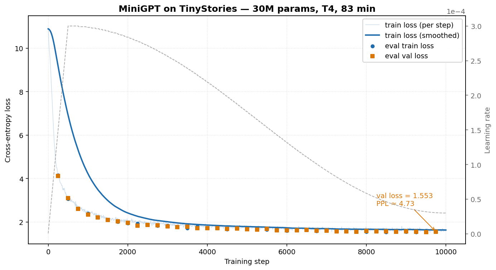

<div align="center">

# 🧠 MiniGPT-from-scratch

**用 PyTorch 从零实现一个 ~30M 参数的 GPT，1 小时在 Colab 免费 T4 上学会写英文短故事。**

[](https://www.python.org/)
[](https://pytorch.org/)
[](./LICENSE)
[](https://colab.research.google.com/github/SherlockDavis/MiniGPT-from-scratch/blob/main/MiniGPT.ipynb)

</div>

---

## ✨ 亮点

- 🔧 **真·从零** —— 拒绝 `nn.MultiheadAttention` / `transformers`，手写 LayerNorm / Causal Self-Attention / MLP / Block / GPT
- ⚡ **1 小时收敛** —— Colab 免费 T4，10000 步 / 83 min，**val PPL ≈ 4.7**
- 📦 **代码精简** —— `model.py` 不到 200 行，全项目核心 < 1000 行
- 🎬 **真的能写故事** —— 见下方实测样本，"Once upon a time, there was a little girl named Lily..."
- 📊 **生产级训练栈** —— FP16 混合精度 + 梯度累积 + cosine LR schedule（wandb 监控可选，默认开启）
- 📝 **配套技术博客** —— 三篇深度文章，从 LayerNorm 数学讲到 nucleus sampling 实现

---

## 🎬 一眼看效果

**Prompt**: `"Once upon a time"` → 用 `ckpt_step10000.pt` 贪心解码 200 token：

> Once upon a time, there was a little girl named Lily. She loved to play with her toys and eat yummy food. One day, she found a big, red apple in her kitchen. She was very happy and wanted to eat it all.
>
> Lily tried to pick the apple, but it was too high. She tried to jump, but she could not reach it. She felt sad and sat down on a chair. A kind bird saw Lily and asked, *"Why are you sad, Lily?"*
>
> Lily said, *"I want the apple, but it is too high for me."* The bird had an idea. The bird flew up and picked the apple for Lily. Lily was so happy and thanked the bird. They played together every day. […] And they lived happily ever after.`<|endoftext|>`

完整三段式叙事 + 自然出现 EOT，一个 30M 模型在 1 小时训练后能做到这件事。下面 [Sample Outputs](#-sample-outputs) 节有 4 种解码模式的对比。

---

## 📈 训练曲线



| 指标 | 数值 |
|------|------|
| Train loss (final) | 1.60 |
| Val loss (final) | 1.55 |
| **Val perplexity** | **≈ 4.73** |
| 训练时间 | 83 min（单卡 T4，FP16 AMP）|
| 训练步数 | 10000 |
| 有效 batch size | 64 × 256 tokens = 16384 tokens/step |

> 💡 远低于 CLAUDE.md 设定的"PPL < 15"目标。Loss 在 warmup 结束后从 ~5.5 平滑下降到 1.55，无 spike、无发散。

---

## 🚀 Quick Start

### 本地（带 GPU）

```bash
# 1. 克隆 + 装依赖
git clone https://github.com/SherlockDavis/MiniGPT-from-scratch.git
cd MiniGPT-from-scratch
pip install -r requirements.txt

# 2. 下载 TinyStories 数据
bash scripts/download_data.sh

# 3. 训练（10000 步，T4 上 ~83 min）
python train.py

# 4. 生成
python generate.py --checkpoint checkpoints/ckpt_step10000.pt \
    --prompt "Once upon a time" --max-new-tokens 200 \
    --temperature 0.8 --top-p 0.9
```

### Google Colab 一键运行

[](https://colab.research.google.com/github/SherlockDavis/MiniGPT-from-scratch/blob/main/MiniGPT.ipynb)

点上面的徽章在 Colab 里打开 [`MiniGPT.ipynb`](./MiniGPT.ipynb) → Runtime → Change runtime type → T4 GPU → Run all。

### 显存不够？

```bash
# 6 GB 显存：保持有效 batch=64
python train.py --batch-size 16 --grad-accum-steps 4
```

---

## 🏗️ 架构

```
Input tokens (B, T)
  → Token Embedding + Position Embedding   (B, T, 384)
  → 6 × TransformerBlock                   (B, T, 384)
       ├── Pre-LN
       ├── Causal Multi-Head Self-Attention (6 heads)
       └── MLP (384 → 1536 → 384, GELU)
  → final LayerNorm                        (B, T, 384)
  → LM Head (weight-tied to embedding)     (B, T, 50257)
```

| 超参数 | 值 |
|--------|-----|
| Layers (`n_layer`) | 6 |
| Heads (`n_head`) | 6 |
| Embedding dim (`n_embd`) | 384 |
| Context length (`block_size`) | 256 |
| Vocab size | 50257 (GPT-2 BPE) |
| Dropout | 0.1 |
| **Total params** | **~30.0M**（其中 token embedding ~19.3M）|

> 📐 想知道每个组件的数学和实现细节？看 [Part 1: 架构篇](./blog/part1_architecture.md)。

---

## 🎬 Sample Outputs

所有样本来自 `checkpoints/ckpt_step10000.pt`，`prompt = "Once upon a time"`，`seed=42`，`max_new_tokens=200`。

<details open>
<summary><b>Greedy</b> (<code>--temperature 0.0</code>) — 确定性，最"安全"</summary>

> Once upon a time, there was a little girl named Lily. She loved to play with her toys and eat yummy food. One day, she found a big, red apple in her kitchen. […] Lily and the bird became good friends. They played together every day. And they lived happily ever after.

</details>

<details>
<summary><b>Temperature 0.8</b> — 推荐的叙事区间</summary>

> Once upon a time, there was a little boy named Tim. Tim had a friend, a big cat named Sam. They liked to play together. One day, Tim and Sam wanted to make a game with the chalk. Tim said, *"Let's play!"* Sam agreed, and they started to play. They drew a big sun, a house, and a tall tree. They laughed and had fun. […]

</details>

<details>
<summary><b>Top-k 40</b> — 排除长尾噪声</summary>

> Once upon a time, there was a little boy named Tim. Tim had a friend, a big cat named Sam. They liked to play all day. One day, they found a big, pretty curtain in the living room. They were very curious about what was inside. […]

</details>

<details>
<summary><b>Top-p 0.9 (nucleus)</b> — 自适应"长尾"</summary>

> Once upon a time, there was a little boy named Tim. Tim had a friend named Sam. They liked to play with their toys and have fun together. One day, they wanted to make a big igloo. […]

</details>

**模型学到了什么**：三段式叙事结构（角色 → 冲突 → 解决）、儿童词汇、对话引号规范、自然出现 `<|endoftext|>`。

**已知短板**：偶尔在某些 prompt 上出现复读（30M 模型的典型局限），可通过 `--top-p 0.95 --temperature 0.9` 或加 `repetition_penalty` 缓解。

> 🎲 想知道四种解码的实现原理和踩坑？看 [Part 3: 生成篇](./blog/part3_generation.md)。

---

## 📝 配套技术博客

| 篇 | 主题 | 对应代码 |
|----|------|----------|
| **[Part 1: 架构篇](./blog/part1_architecture.md)** | LayerNorm → Attention → MLP → Block → GPT，五个模块的数学与实现 | `model.py` |
| **[Part 2: 训练篇](./blog/part2_training.md)** | 数据流水线 + AMP + 梯度累积 + LR schedule + wandb | `train.py` / `utils.py` |
| **[Part 3: 生成篇](./blog/part3_generation.md)** | 四种解码模式（greedy / temperature / top-k / top-p）的原理 + 实现 | `generate.py` |

每篇结尾都有"我自己踩过的坑"表格——纯 nanoGPT 复现的文章一般不会写。

---

## 📂 项目结构

```
MiniGPT-from-scratch/
├── config.py              # GPTConfig 超参数 dataclass
├── model.py               # 核心：LayerNorm / CausalSelfAttention / MLP / Block / GPT
├── utils.py               # 数据加载 + tokenizer 封装
├── train.py               # 训练循环（AMP / 梯度累积 / cosine LR / wandb）
├── generate.py            # 推理 + 4 种解码模式
├── tests/                 # pytest 单元测试
├── scripts/
│   ├── download_data.sh   # 下载 TinyStories
│   └── plot_loss_curve.py # 从训练日志重生成 loss 曲线
├── blog/                  # 三篇技术博客
└── assets/                # 图片资源（loss 曲线等）
```

---

## 🛠️ 复现细节

- **Tokenizer**：GPT-2 BPE（`vocab_size=50257`）。预处理用 Rust 版（`tokenizers` 库）的 `encode_batch`，比 Python 版快 10–50×
- **存储格式**：token id 用 `uint16` 存盘（GPT-2 vocab < 65536），磁盘和 I/O 比 `int64` 省 4×
- **数据加载**：`np.memmap` 零拷贝读取，~500 MB 训练 token 不进内存
- **优化器**：AdamW（默认 betas (0.9, 0.999)），lr `3e-4`，weight decay 默认
- **Schedule**：500 步 linear warmup → 9500 步 cosine decay 到 `peak_lr × 0.1`
- **稳定性**：FP16 + GradScaler 自适应 loss scaling，gradient clip 1.0，loss 非有限立刻 fail-fast

---

## 🙏 Acknowledgments

- [nanoGPT](https://github.com/karpathy/nanoGPT) by Andrej Karpathy —— 极简 GPT 实现的灵感来源
- [TinyStories](https://huggingface.co/datasets/roneneldan/TinyStories) by Eldan & Li —— 专为小模型设计的合成数据集
- [Attention Is All You Need](https://arxiv.org/abs/1706.03762) (Vaswani et al., 2017)
- [Language Models are Unsupervised Multitask Learners](https://cdn.openai.com/better-language-models/language_models_are_unsupervised_multitask_learners.pdf) (GPT-2)

---

## 📄 License

MIT — 自由 fork、自由学习。如果对你有帮助，欢迎 ⭐ 一下。
